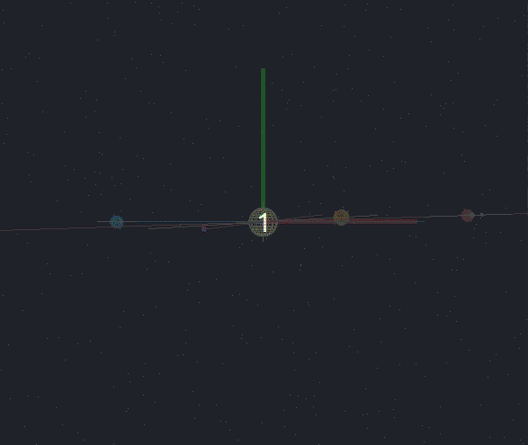
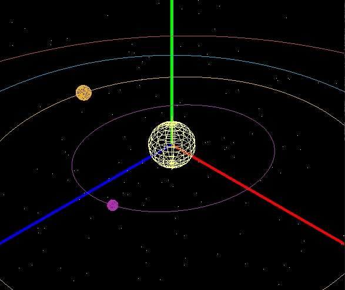

# UoM
Documentation of courseworks at University of Manchester


## Documented Courseworks
- [COMP21111](#21111)
- [COMP23111](#23111)
- [COMP24111.2 Face Classification](#2411102)
- [COMP24111.3 Spam Classification](#2411103)
- [COMP24412](#24412)
- [COMP26120](#26120)
- [COMP27112](#27112)
- [COMP27112.2 Orrery Simulation](#2711202)
- [COMP28112.1 Servers and Clients](#2811201)
- [COMP28112.2 Hotel Booking](#2811202)
- [COMP28112.3 Multi-instance server simulation](#2811203)


<a name="21111"></a>
## [COMP21111]

<table>
  <tr>
    <td>ex01/02: satisfiability</td>
    <td>ex03: convertion to CNF</td>
    <td>ex04: DPLL algorithm</td>
  </tr>
  <tr>
    <td>ex05: SAT algorithm; tableaux</td>
    <td>ex06: OBDD</td>
    <td>ex07/08: FOL</td>
  </tr>
  <tr>
    <td>ex09: state transition</td>
    <td>ex10: LTL formula</td>
  </tr>
</table>


<a name="23111"></a>
## [COMP23111]
Build a SQL DB according to data requirements described in natural language. Each exercise reflects a step. Exercise subtitles are self-explanatory.


### 1. Technologies
SQL


<a name="2411102"></a>
## [COMP24111.2 Face Classification]
Use KNN and linear classification for face classification. 


### 1. Getting Started
Open the project in Matlab, run task1a.m, task1b.m, task2a.m, task2b.m seperately to get result for each subtask.


### 2. Technologies
Matlab


### 3. Tests
- task1a.m - Use KNN to classify samples of 2 classes with K in [1, 6]. Display results over 50 repetitive experiments visually and quantitatively.
- task1b.m - Use leave-one-out cross-validation to determine the best k value (for the dataset). Use KNN to classify samples of 40 classes. Calculate mean and std of accuracy over 50 repetitive experiments. 
- task2a.m - Use linear classification to classify samples of 2 classes.
- task2b.m - Use linear classification to classify samples of 40 classes. Compare results with teat1a.

In test1a and 2a, false results will have a frame added for easy identification:


while correctly classified test samples won't have it. 


### 4. Dataset
The dataset is ORLfacedata.mat which contians labeled face shots of 40 people, each person with 10 images. See 'data' and 'labels' to understand sample-label mapping.


### 5. Result
test1a.m: [plot of training accuracy versus k](yr2/COMP24111%20Machine%20Learning%20and%20Optimisation/lab02%20Face%20Recognition/readme-img/t1a_test.JPG); [plot of testing accuracy versus k](yr2/COMP24111%20Machine%20Learning%20and%20Optimisation/lab02%20Face%20Recognition/readme-img/t1a_train.JPG).

test1b.m: accuracy/standard deviation across 40 classes: 88.17%/0.0248.

test2a.m: testing accuracy over 50 rounds: 93.86%.

Result analysis is given in lab report.


<a name="2411103"></a>
## [COMP24111.3 Spam Classification]
Use Naive Bayes for Spam Recognition. Emails are preprocessed so each is represented by a vector.


### 1. Getting Started
Open the project in Matlab, run main.m. filename could be one of the following: (avc_c2.mat, av7_c3.mat, av3_c2.mat, av2_c2.mat, spambase.data).


### 2. Technologies
Matlab


### 3. Tests
 - avdis_t.m - for 3 discrete-valued datasets.
 - avcon_t.m - for continuous-valued avc_c2.mat. 
 - spam_t.m - for Spambase.data. 10-fold cross validation is conducted, visualized result is given to present result in each fold.


### 4. Dataset
 - av2_c2 - a dataset for binary classification where each attribute has two discrete values.
 - av3_c2 - a dataset for binary classification where each attribute has three discrete values.
 - av7_c3 - a dataset for three-class classification where each attribute has seven discrete values.
 - avc_c2 - a dataset for binary classification where all attributes have continuous values that are assumed to be subject to Gaussian distribution.
 - Spambase.data – [the original UCI spambase database](http://archive.ics.uci.edu/ml/datasets/Spambase).


### 5. Result
 - av2_c2.mat: 89.0%; 
 - av3_c2.mat: 89.2%; 
 - av7_c3.mat: 86.6%; 
 - avc_c2.mat: 76.4%; 
 - spambase.data - 81.7%. 

Result analysis is given in lab report.


<a name="24412"></a>
## [COMP24412]
- ex1: Prolog

  constraint satisfaction; recursion; list

- ex2: Prolog & Vampire

  Prolog arithmatic; real-world modeling with Prolog; First Order Logic (FOL) Knowledge Base resolution with Vampire; real-world modeling with FOL

- ex3: Knowledge Representation in Metallurgy

  Translate sentences into Context Free Grammars (CFGs), Definite Clause Grammars (DFGs), Combinatory Categorical Grammars (CCGs) and NLTK lambda-calculus. Build parse tree for facts and questions.

  Do POS-tag analysis on facts, build dependency structures, use Open Information Extraction (OpenIE) to extract the predicate-argument structure and eventually build the knowledge base for inference and question answering.

Read Lab instruction under project directory for details.


### 1. Technologies
Prolog, [Vampire](https://vprover.github.io/download.html), [NLTK](https://github.com/nltk/nltk), [Graphene](https://github.com/Lambda-3/Graphene), [CoreNLP](http://corenlp.run/)


<a name="26120"></a>
## [COMP26120]
C implementation of algorithms and data structures. Use makefile in each folder to compile.
 - ex01: pseudocode practice
 - ex02: C-string; I/O; cmdline args
 - ex03: pointer; array; C-struct; GDB; valgrind
 - ex04: C-union; CRUD on singly/doubly linked list
 - ex05: bubble+bucket+insertion sort; time complexity analysis
 - ex06: merge+quick sort; binary search
 - ex07: tree serialization/unserialization
 - ex08: AVL tree; hashtable
 - ex09: graph; BFS, DFS
 - ex10: queue; prioirty queue; Dijkstra; best-first search
 - ex11: graph building (with topic of NP-completeness)
 - ex12: greedy; dp(knapsack); branch-and-bound
 - ex13: cryptography


### 1. Technologies
C, GDB, valgrind


<a name="27112"></a>
## [COMP27112]
Familiar with basic OpenGL & OpenCV, compile command similar with that in COMP27112.2
<table>
  <tr>
    <td>cwk1: OpenGL basic func args</td>
    <td>cwk2: 3D modelling with AC3D</td>
  </tr>
  <tr>
    <td>cwk3: OpenGL object texture</td>
    <td>cwk4: OpenCV hello world</td>
  </tr>
  <tr>
    <td>cwk5: OpenCV img thresholding</td>
  </tr>
  <tr>
    <td>ex1: OpenGL world navigation</td>
    <td><a href="#2711202">ex2: build an orrery from scratch</a></td>
  </tr>
  <tr>
    <td>ex3: img blurring & diff</td>
    <td>ex4: edge detection with Canny & Hough algorithm</td>
  </tr>
</table>


### 1. Technologies
C/C++, OpnGL, OpenCV


<a name="2711202" id="2711202"></a>
## [COMP27112.2 Orrery Simulation]
Generate an animated orrery with starfield as background and orbital path. 
 
Parameters for sun and each planet are given in 'sys'.


### 1. Getting Started
compile ex2.c, cmd:
```
gcc -o test part8.c -lGL -lGLU -lglut -ldl -lm
```
where -lGL -lGLU -lglut links OpenGL libs, -ldl -lm links math libs. (parameter order matters!)


### 2. Technologies
OpenGL


### 3. Result
#### Orrery simulation:

4 viewing modes available. 

Press '1' for overlook view (also the initial mode when starting the executable).


Press '2' for ecliptic view.



Press '3' for spaceship view.



Press '4' for earth view (always looking at the sun)


#### Flying around:

Playable in spaceship view. Assume blue axis point to the front.

Press '↑'/'↓' to move forward/backward


Press '←'/'→' to look aside


Press ','/'.' to move leftward/rightward


Press 'pg up'/'pg down' to move upward/downward


#### Other functionalities:  
Press 'a' to switch on/off axis


<a name="2811201"></a>
## [COMP28112.1 Servers and Clients]
Investigate 3 ways of client-server interaction: socket, servlet and RMI(Java's RPC implementation, deprecated after i.8)


### 1. Getting Started
#### Socket
Server: 
```
# compile
javac SocketServer.java
# run
java SocketServer
```
Client:

After the server terminal says 'Server starts running', start another terminal, enter cmd:
```
telnet (name of your PC) 8181
```
port 8181 is listened by server which can be changed in SocketServer.java. If successful, the terminal will show(foo is my PC name):
```
Trying (your IP address)...
Connected to foo.lan.
Escape character is '^]'.
```
now type 'whoRU' or other random string to see different response. The telnet will end immediately after getting response, restart it to try with other messages.

#### RMI
Server:
```
# run rmiregistry
rmiregistry &
# compile
javac RMServer.java
# run
java RMServer
```
Client:

After the server terminal says 'Server starts running', start another terminal.
```
# compile
javac RMClient.java
# run
java RMClient (arg1) (arg2)
```
where arg1 is your PC name, arg2 is whoRU or other random string to play with. Client will stop immediately after getting response.

#### Servlet
Server:
```
javac -classpath ./jsdk.jar SimpleServlet.java
./servletrunner -d (absolue path of ex1 folder)
```
(Error: Could not find or load main class sun.servlet.http.HttpServlet?)


### 2. Technologies
Java (for RMI, only version before 1.9 allowed)


<a name="2811202"></a>
## [COMP28112.2 Hotel Booking]
We have a server that records hotel and band slots (smaller number for earlier slots), implement a client for booking hotel rooms and band slots and their number must match. Manually introduced random server down may appear. Anyone can hold at most 2 slots at the same time. Functionalities need to implement include: booking a slot (with possible error handling); cancel booking for a slot (with possible error handling); checking slots you have booked; finding free slots.


### 1. Getting Started
not available, server held by the professor


### 2. Technologies
Java, XML, HTTP


<a name="2811203"></a>
## [COMP28112.3 Multi-instance server simulation]
Simulation of multi-server query processing pipeline with statistics gathered, a simpler, single thread version of USC CSCI-402.


### 1. Getting Started
```
python lab3.py (queue_size) (arrival_rate) (number_of_servers) (execution_time)
```


### 2. Technologies
python


[COMP21111]: <yr2/COMP21111%20Logic%20and%20Modelling>
[COMP23111]: <yr2/COMP23111%20Fundamentals%20of%20Databases>
[COMP24111.2 Face Classification]: <yr2/COMP24111%20Machine%20Learning%20and%20Optimisation/lab02%20Face%20Recognition>
[COMP24111.3 Spam Classification]: <yr2/COMP24111%20Machine%20Learning%20and%20Optimisation/lab03%20Spam%20Classification>
[COMP24412]: <yr2/COMP24412%20Symbolic%20AI>
[COMP26120]: <yr2/COMP26120%20Algorithms%20and%20Imperative%20Programming>
[COMP27112]:  <yr2/COMP27112%20Computer%20Graphics%20and%20Image%20Processing>
[COMP27112.2 Orrery Simulation]: <yr2/COMP27112%20Computer%20Graphics%20and%20Image%20Processing/ex2>
[COMP28112.1 Servers and Clients]: <yr2/COMP28112%20Distributed%20Computing/ex1>
[COMP28112.2 Hotel Booking]: <yr2/COMP28112%20Distributed%20Computing/ex22>
[COMP28112.3 Multi-instance server simulation]:  <yr2/COMP28112%20Distributed%20Computing/ex3>

## TODO
 - pass all tests for COMP23412.2
 - build a server for COMP28112.2
