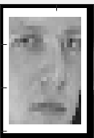

# COMP24111
## COMP24111.2 Face Classification
Use KNN and linear classification for face classification. 

### 1. Getting Started
Open the project in Matlab, run task1a.m, task1b.m, task2a.m, task2b.m seperately to get result for each subtask.

### 2. Technologies
Matlab

### 3. Tests
- task1a.m - Use KNN to classify samples of 2 classes with K in [1, 6]. Display results over 50 repetitive experiments visually and quantitatively.
- task1b.m - Use leave-one-out cross-validation to determine the best k value (for the dataset). Use KNN to classify samples of 40 classes. Calculate mean and std of accuracy over 50 repetitive experiments. 
- task2a.m - Use linear classification to classify samples of 2 classes.
- task2b.m - Use linear classification to classify samples of 40 classes. Compare results with teat1a.

In test1a and 2a, false negatives will have a frame added for easy identification:

while true positives won't have it:

### 4. Dataset
The dataset is ORLfacedata.mat which contians labeled face shots of 40 people, each person with 10 images. See 'data' and 'labels' to understand sample-label mapping.

### 5. Result
test1a.m: [plot of training accuracy versus k](../../media/24111_2/1a_train_acc.jpg); [plot of testing accuracy versus k](../../media/24111_2/1a_test_acc.jpg).

test1b.m: accuracy/standard deviation across 40 classes: 88.17%/0.0248.

test2a.m: testing accuracy over 50 rounds: 93.86%.

test2b.m: [Linear classier performs generally better than 1-NN](../../media/24111_2/2b_res_comp.jpg).

Result analysis is given in lab report.

## COMP24111.3 Spam Classification
Use Naive Bayes for Spam Recognition. Emails are preprocessed so each is represented by a vector.

### 1. Getting Started
Open the project in Matlab, run main.m. filename could be one of the following: (avc_c2.mat, av7_c3.mat, av3_c2.mat, av2_c2.mat, spambase.data).

Purpose of each file is given in heading annotation.

### 2. Technologies
Matlab

### 3. Tests
 - avdis_t.m - for 3 discrete-valued datasets.
 - avcon_t.m - for continuous-valued avc_c2.mat. 
 - spam_t.m - for Spambase.data. 10-fold cross validation is conducted, visualized result is given to present result in each fold.

### 4. Dataset
 - av2_c2 - a dataset for binary classification where each attribute has two discrete values.
 - av3_c2 - a dataset for binary classification where each attribute has three discrete values.
 - av7_c3 - a dataset for three-class classification where each attribute has seven discrete values.
 - avc_c2 - a dataset for binary classification where all attributes have continuous values that are assumed to be subject to Gaussian distribution.
 - Spambase.data – [the original UCI spambase database](http://archive.ics.uci.edu/ml/datasets/Spambase).

### 5. Result
 - av2_c2.mat: 89.0%; 
 - av3_c2.mat: 89.2%; 
 - av7_c3.mat: 86.6%; 
 - avc_c2.mat: 76.4%; 
 - spambase.data - 81.7%. 

Result analysis is given in lab report.
