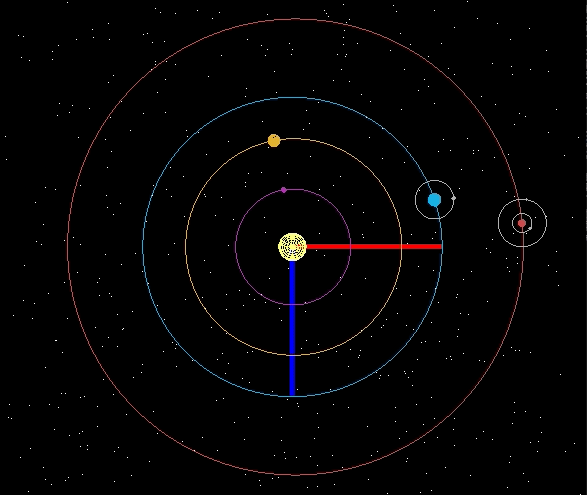
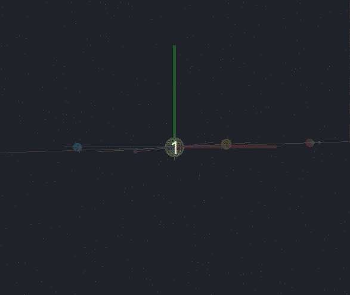
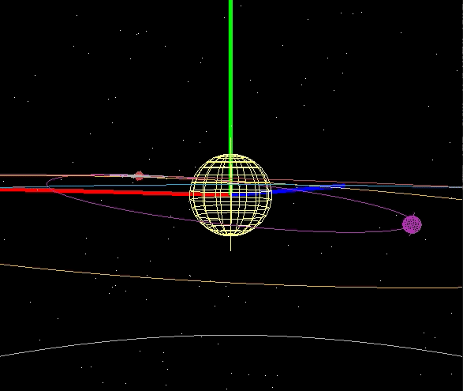
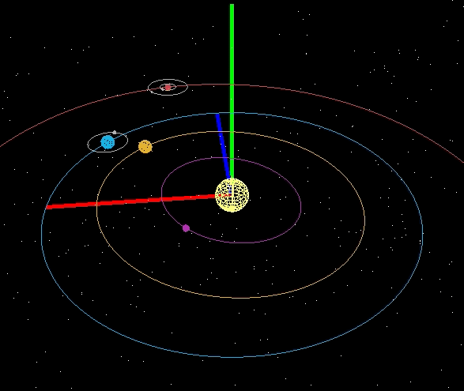
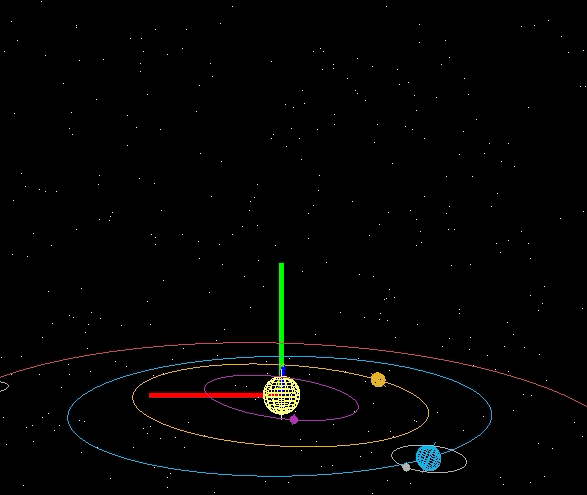
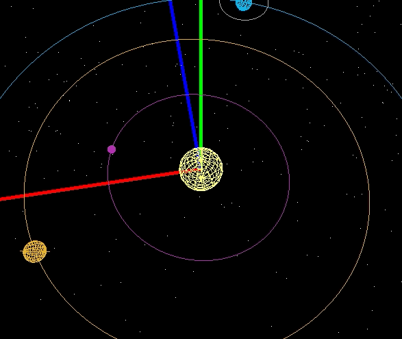
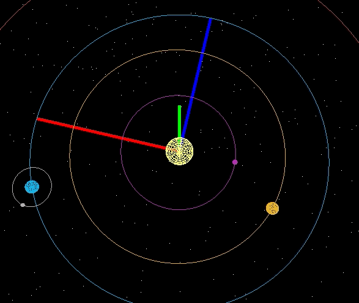

# COMP27112
Familiar with basic OpenGL & OpenCV, compile command similar with that in COMP27112.2
<table>
  <tr>
    <td>cwk1: OpenGL basic func args</td>
    <td>cwk2: 3D modelling with AC3D</td>
  </tr>
  <tr>
    <td>cwk3: OpenGL object texture</td>
    <td>cwk4: OpenCV hello world</td>
  </tr>
  <tr>
    <td>cwk5: OpenCV img thresholding</td>
  </tr>
  <tr>
    <td>ex1: OpenGL world navigation</td>
    <td><a href="#2711202">ex2: build an orrery from scratch</a></td>
  </tr>
  <tr>
    <td>ex3: img blurring & diff</td>
    <td>ex4: edge detection with Canny & Hough algorithm</td>
  </tr>
</table>


### 1. Technologies
C/C++, OpnGL, OpenCV


<a id="2711202"></a>
## COMP27112.2 Orrery Simulation
Generate an animated orrery with starfield as background and orbital path. 
 
Parameters for sun and each planet are given in 'sys'.


### 1. Getting Started
compile ex2.c, cmd:
```
gcc -o test part8.c -lGL -lGLU -lglut -ldl -lm
```
where -lGL -lGLU -lglut links OpenGL libs, -ldl -lm links math libs. (parameter order matters!)


### 2. Technologies
C, OpenGL


### 3. Result
#### Orrery simulation:

4 viewing modes available. 

Press '1' for overlook view (also the initial mode when starting the executable).



Press '2' for ecliptic view.



Press '3' for spaceship view.


Press '4' for earth view (always looking at the sun)



#### Flying around:

Playable in spaceship view. Assume blue axis point to the front.

Press '↑'/'↓' to move forward/backward



Press '←'/'→' to look aside



Press ','/'.' to move leftward/rightward



Press 'pg up'/'pg down' to move upward/downward




#### Other functionalities:  
Press 'a' to switch on/off axis
