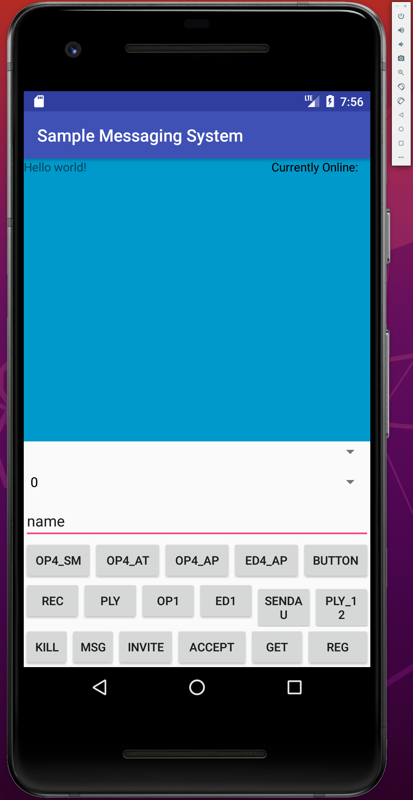

# COMP28512
 - ex1: audio sampling and encoding
 - ex2: Frequency-domain audio processing, discontinuity elimination, run-length coding
 - ex3: Bit error check
 - ex4+5: Chat App Development

### 1. Getting Started:
execute .ipynb script in each ex


### 2. Technologies:
python 2


## COMP28512.4/5 Chat App with Image & Audio 
Develop an Android App that can communicate with dummy BARRYBOT through server. The app can be installed on an Android device/simulator.


### 1. Getting Started:
Open project in Android Studio, build. In the first few times build may fail due to missing tools (e.g. Anfroid SDK), follow instructions to install.

Start server (only work with python 2):
```
python serverLB.py
```

Start BarryBot:
```
./BARRYBOTLB.PYC
```
BarryBot will disconnect automatically once server is offline.

Now that server has been started, we can run the chat app on emulator/an Andriod device.


### 2. Technologies:
Android Studio, Java


### 3. Result
Test report available in ex4 & ex5.

App layout:



#### Buttons Explanation
##### Chat
 - REG: input your username in input box, then click REG to register the username.
 - GET: click to retrieve all online users, the list will be displayed under "Currently Online" area and parsed at dropdown menu above input box, where every user can be chosen
 - ACCEPT: click to accept invitation from other users
 - INVITE: choose the user you want to chat with in the dropdown menu, then click it to send invitation.
 - MSG: input message in the input box, choose message recipient in the dropdown menu (should be someone you already set up connection with), click it to send the message.

Watch the video demo to get a more intuitive view.

##### Audio
 - OP1: click to play an Audio.
 - ED1: click to end playing the audio stated by OP1
 - OP4_AP: click to play an audio with same content, but with packet loss introduced
 - ED4_AP: click to end playing the file started by OP4_AP
 - OP4_AT: click to play the same audio, but from AudioTrack 
 - OP4_SM: click to play the audio repaired by smoothing
 - REC: click to record a speech, "REC" will become "DONE" when recording ends
 - PLY: play the recorded audio
 - OP1: 
 - SENDAU: send the recorded audio to BarryBot (the client given by course instructor)

##### Others
 - BUTTON: go to a page that displays some images
 - KILL: quit the app

#### Videos
[Demo video for chatting functionalities]()

[Play audio & display image on Android instance]()
### TODO
 - Implement DECLINE & END for chatting
 - instance on mobile cannot connect to server
 - fix microphone related operations (REC, PLY, SENDAU)