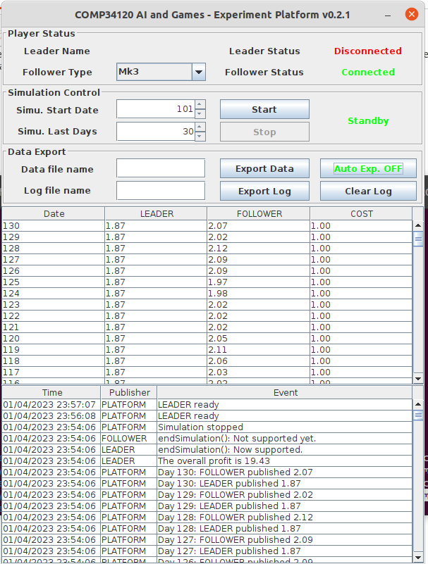

## COMP34120.2
Collaborator: [Bowen Cai](https://github.com/cbwchuck), [Yueer Mao](https://github.com/EjoMYE)

### 0. Background
()?

Trading info has been given for 100 days. Design your Leader to maximize the profit starting from day 101 within 30-day period.

Platform is given by the instructor, including:
 - src/Platform.java
 - src/Player.java
 - src/PlayerImpl.java
 - src/PlayerType.java
 - src/Record.java,
 - jars/poi-3.7-20101029.jar

and all .class files in comp34120/ex2/

src/PseudoLeader.java: starting code of Leader

src/SimpleLeaderOriginal.java: sample Leader that gives random price each day

src/Leader1_MW.java: online learning w/ moving window

src/Leader2_WLS.java: online learning w/ Weighting Least Square with Forgetting Factor

src/Leader3_RLS.java: online learning w/ Recursive Least Square with Forgetting Factor

### 1. Getting Started
ALL COMMAND SHOULD BE RUNNED UNDER THIS DIRECTORY

#### build platform
1. compile .class files for platform
```
javac -d . src/Platform.java src/Player.java src/PlayerImpl.java src/PlayerType.java src/Record.java
```
5 corresponding .class files will be generated under comp34120/ex2/

2. start platform
open a terminal,
```
rmiregistry
```
open the 2nd terminal,
```
java -classpath jars/poi-3.7-20101029.jar: -Djava.rmi.server.hostname=127.0.0.1 comp34120.ex2.Main
```
now we can see the platform GUI start.

3. build & run Leaders

Ctrl^C to stop Leader running. Stop the currently running Leader to disconnect it with platform and compile & run another.

src/SimpleLeaderOriginal.java:
```
javac -d . src/SimpleLeaderOriginal.java
java -Djava.rmi.server.hostname=127.0.0.1 SimpleLeaderCustom
```

src/Leader1_MW.java:
```
javac -d . -cp jars/commons-math3-3.6.1.jar:. src/Leader1_MW.java
java -cp jars/commons-math3-3.6.1.jar:. -Djava.rmi.server.hostname=127.0.0.1 Leader1
```

src/Leader2_WLS.java:
```
javac -d . -cp jars/commons-math3-3.6.1.jar:. src/Leader2_WLS.java
java -cp jars/commons-math3-3.6.1.jar:. -Djava.rmi.server.hostname=127.0.0.1 Leader2
```

src/Leader3_RLS.java:
```
javac -d . -cp jars/commons-math3-3.6.1.jar:. src/Leader3_RLS.java
java -cp jars/commons-math3-3.6.1.jar:. -Djava.rmi.server.hostname=127.0.0.1 Leader3
```

4. Game Running
Before we run any leader, the platform will look like:



If we run a leader, the Leader Status should be "Connected", and we can start the simulation.

Simulation is destined to be start on the day 101, and max simulation length (Simu.Last Days) is 30 days.

After we click "Start", Simulation will finish quickly (if your leader is not too slow), and running log is published at the bottom of the GUI.

We can fill in Data file name and Log file name and export data and log respectively, click "Export Data"/"Export Log", and corresponding (Data file name).xls and (Log file name).xls will be placed at current dir.


### 2. Technologies
Java


### 3. Result
recorded in price_log.md