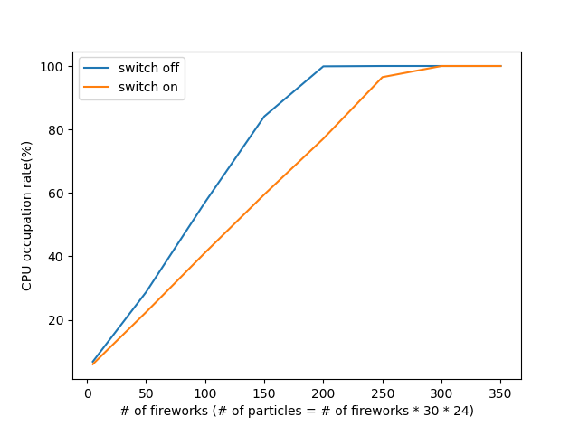
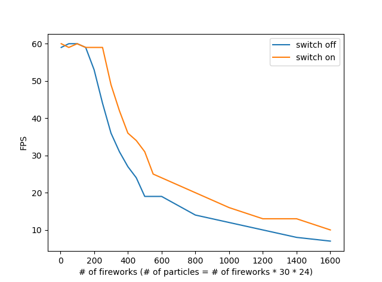
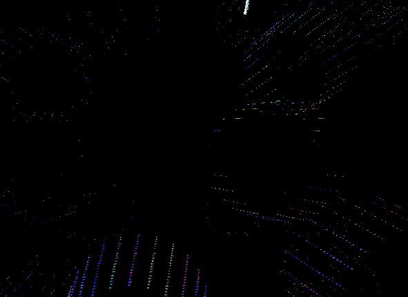
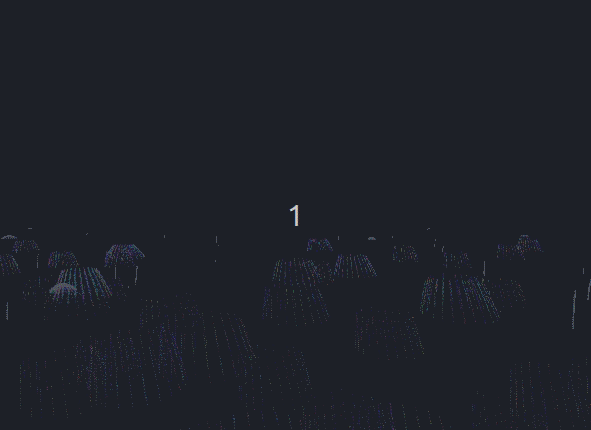
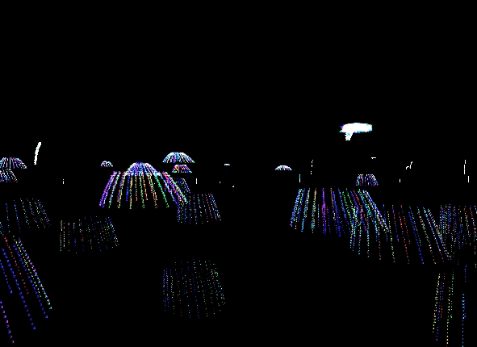

# COMP37111 Particle System
Build a particle system (firework emitter in my case), pressure test on particle number VS CPU usage and FPS

## 1. Getting Started
```
# Compile
gcc integration.c -o integration -lGLU -lGL -lglut -lm -std=c99
# run
./integration
```

## 2. Technologies
C, OpenGL, python


## 3. Test
Number of particles vs. CPU occupation rate

Number of particles vs FPS



## 4. Result
### View Switch
press '1' for overlook view, '2' for ecliptic view, '3' for free navigation mode


### Navigation
press '↑'/'↓'/'←'/'→'/'pg up'/'pg dn' for moving front/back/left/right/up/down


### Parameter Change
press 'Q'/'A' for adjusting initial speed of fireworks


press 'W'/'S' for fireworks' lifetime


'shining stars' appear when lifetime of fireworks end before they can explode

press 'R'/'F' for global wind speed
